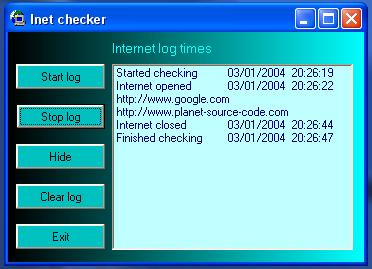



## internet logger, updated see info

### Description

will check and log if internet is open/closed and which sites are visited. updated so it will find the urls no matter how many windows are open and you can open the urls by dblclicking the item in the listbox.
 
### More Info
 

             |
---                |---
**Submitted On**   |2004-01-04 14:26:02
**By**             |[stephen whittle](https://github.com/Planet-Source-Code/PSCIndex/blob/master/ByAuthor/stephen-whittle.md)
**Level**          |Beginner
**User Rating**    |5.0 (15 globes from 3 users)
**Compatibility**  |VB 6\.0
**Category**       |[Files/ File Controls/ Input/ Output](https://github.com/Planet-Source-Code/PSCIndex/blob/master/ByCategory/files-file-controls-input-output__1-3.md)
**World**          |[Visual Basic](https://github.com/Planet-Source-Code/PSCIndex/blob/master/ByWorld/visual-basic.md)
**Archive File**   |[internet\_l169042142004\.zip](https://github.com/Planet-Source-Code/stephen-whittle-internet-logger-updated-see-info__1-50783/archive/master.zip)

